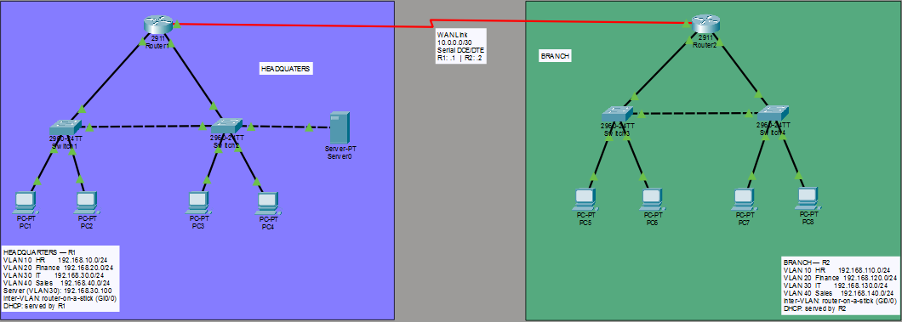

# Multi-Branch Enterprise Network with VLANs

A two-site corporate network built in Cisco Packet Tracer, demonstrating VLAN segmentation, 802.1Q trunking, router-on-a-stick inter-VLAN routing, centralized DHCP per VLAN, and a serial WAN link with static routing between sites.

 **[Read the full write-up on Medium](https://medium.com/@kwadwoosei724/i-spent-45-minutes-troubleshooting-a-cisco-network-that-had-nothing-wrong-with-it-9d1362633d20)**
---

## What this project demonstrates

- VLAN design and segmentation by department
- 802.1Q trunking between switches and to a router
- Router-on-a-stick inter-VLAN routing using sub-interfaces
- Centralised DHCP serving multiple VLANs from a single router
- Serial WAN connectivity between two sites with DCE/DTE clocking
- Static routing for inter-site reachability
- Hosting a DNS/HTTP server inside an internal VLAN

## Topology



Two sites — HQ and Branch — each with a 2911 router trunked to two 2960 switches. Four departmental VLANs per site (HR, Finance, IT, Sales). Sites connected by a Serial DCE/DTE link.

## IP addressing plan

| Site | VLAN | Network | Gateway | DHCP Pool |
|------|------|---------|---------|-----------|
| HQ | 10 — HR | 192.168.10.0/24 | 192.168.10.1 | .10–.100 |
| HQ | 20 — Finance | 192.168.20.0/24 | 192.168.20.1 | .10–.100 |
| HQ | 30 — IT | 192.168.30.0/24 | 192.168.30.1 | .10–.100 (server static .100) |
| HQ | 40 — Sales | 192.168.40.0/24 | 192.168.40.1 | .10–.100 |
| Branch | 10 — HR | 192.168.110.0/24 | 192.168.110.1 | .10–.100 |
| Branch | 20 — Finance | 192.168.120.0/24 | 192.168.120.1 | .10–.100 |
| Branch | 30 — IT | 192.168.130.0/24 | 192.168.130.1 | .10–.100 |
| Branch | 40 — Sales | 192.168.140.0/24 | 192.168.140.1 | .10–.100 |
| WAN | — | 10.0.0.0/30 | R1: .1 / R2: .2 | — |

## Interface map

| Device | Interface | Connects to | Mode / IP |
|--------|-----------|-------------|-----------|
| SW1 (HQ) | Fa0/1–Fa0/4 | HQ PCs | access, VLAN 10/20/30/40 |
| SW1 (HQ) | Gi0/1 | SW2 | trunk |
| SW1 (HQ) | Gi0/2 | R1 Gi0/0 | trunk |
| SW2 (HQ) | Fa0/1 | Server-PT | access, VLAN 30 |
| SW2 (HQ) | Gi0/1 | SW1 | trunk |
| R1 (HQ) | Gi0/0 | SW1 Gi0/2 | trunk (sub-ifs .10/.20/.30/.40) |
| R1 (HQ) | Se0/3/0 | R2 Se0/3/0 | 10.0.0.1/30 (DCE) |
| SW3 (Branch) | Fa0/1–Fa0/4 / Gi0/1–Gi0/2 | PCs / SW4 / R2 | access / trunk / trunk |
| R2 (Branch) | Gi0/0 | SW3 Gi0/2 | trunk (sub-ifs .110/.120/.130/.140) |
| R2 (Branch) | Se0/3/0 | R1 Se0/3/0 | 10.0.0.2/30 (DTE) |

## Devices used

| Device | Qty | Role |
|--------|-----|------|
| Cisco 2911 Router | 2 | R1 (HQ), R2 (Branch) |
| Cisco 2960 Switch | 4 | SW1/SW2 at HQ, SW3/SW4 at Branch |
| Server-PT | 1 | DNS/HTTP at HQ (VLAN 30) |
| PC-PT | 8 | One per VLAN per site |

## Configuration walkthrough

Full configs for every device are in [`configs/`](configs/). Highlights below.

### 1. Switch VLANs and trunks (SW1 — same pattern on SW2/SW3/SW4)

```cisco
SW1(config)# vlan 10
SW1(config-vlan)# name HR
SW1(config-vlan)# vlan 20
SW1(config-vlan)# name Finance
SW1(config-vlan)# vlan 30
SW1(config-vlan)# name IT
SW1(config-vlan)# vlan 40
SW1(config-vlan)# name Sales
SW1(config-vlan)# exit
! Access ports
SW1(config)# interface fa0/1
SW1(config-if)# switchport mode access
SW1(config-if)# switchport access vlan 10
! ...repeat for fa0/2 (VLAN 20), fa0/3 (VLAN 30), fa0/4 (VLAN 40)
! Trunks - Gi0/1 to SW2, Gi0/2 uplink to R1
SW1(config)# interface range gi0/1 - 2
SW1(config-if-range)# switchport mode trunk
SW1(config-if-range)# switchport trunk allowed vlan 10,20,30,40
```

### 2. Router-on-a-stick on R1

```cisco
R1(config)# interface gi0/0
R1(config-if)# no shutdown
R1(config-if)# exit
R1(config)# interface gi0/0.10
R1(config-subif)# encapsulation dot1q 10
R1(config-subif)# ip address 192.168.10.1 255.255.255.0
! ...repeat for .20, .30, .40
R1(config)# interface serial 0/3/0
R1(config-if)# ip address 10.0.0.1 255.255.255.252
R1(config-if)# clock rate 64000
R1(config-if)# no shutdown
```

### 3. DHCP pools on R1

```cisco
R1(config)# ip dhcp excluded-address 192.168.10.1 192.168.10.9
R1(config)# ip dhcp excluded-address 192.168.30.100
R1(config)# ip dhcp pool HR
R1(dhcp-config)# network 192.168.10.0 255.255.255.0
R1(dhcp-config)# default-router 192.168.10.1
R1(dhcp-config)# dns-server 192.168.30.100
! ...repeat for FINANCE, IT, SALES (and on R2 for Branch pools)
```

### 4. Static routes between sites

```cisco
! On R1
R1(config)# ip route 192.168.110.0 255.255.255.0 10.0.0.2
R1(config)# ip route 192.168.120.0 255.255.255.0 10.0.0.2
R1(config)# ip route 192.168.130.0 255.255.255.0 10.0.0.2
R1(config)# ip route 192.168.140.0 255.255.255.0 10.0.0.2

! On R2 (mirror)
R2(config)# ip route 192.168.10.0 255.255.255.0 10.0.0.1
R2(config)# ip route 192.168.20.0 255.255.255.0 10.0.0.1
R2(config)# ip route 192.168.30.0 255.255.255.0 10.0.0.1
R2(config)# ip route 192.168.40.0 255.255.255.0 10.0.0.1
```

## Verification

Sample output and screenshots in [`verification/`](verification/).

| Test | Command | Expected result |
|------|---------|-----------------|
| VLAN database | `show vlan brief` | VLANs 10/20/30/40 with assigned ports |
| Trunks | `show interfaces trunk` | Gi0/1, Gi0/2 trunking, allowed 10,20,30,40 |
| Routing | `show ip route` | Connected + static routes to remote site |
| WAN | `show ip interface brief` | Serial 0/3/0 up/up on both routers |
| DCE confirm | `show controllers serial 0/3/0` | DCE end shows clock rate |
| PC DHCP | `ipconfig` on PC | Address from correct pool |
| Inter-VLAN | `ping 192.168.20.10` from VLAN 10 | Reply after ARP |
| WAN | `ping 192.168.110.10` from HQ VLAN 10 | Reply across the serial link |
| Server | `ping 192.168.30.100` from any PC | Reply (server in VLAN 30) |

## Troubleshooting log

Real issues hit during the build and how they were resolved. This is what separated a working lab from a confident understanding of the design.

### Issue 1 — PCs not getting IP addresses, ping failed everywhere

**Symptom:** Every PC showed `IP Address: <not set>` and pings returned `request timed out`. Routers and switches all looked correctly configured — `show ip interface brief` showed sub-interfaces up/up, DHCP pools were present.

**Diagnosis path:**
1. Ran `show ip dhcp binding` on R1 — empty. No DHCP leases had been handed out.
2. Checked the PC IP configuration — every PC was set to **Static** with no address entered. Packet Tracer defaults PCs to Static mode.
3. The router was fine; the PCs were never *requesting* an address.

**Fix:** On each PC, Desktop → IP Configuration → tick **DHCP**. Within seconds the PCs pulled addresses from the correct pool.

**Lesson:** Always verify the requesting side before assuming the serving side is broken. `show ip dhcp binding` being empty is a strong hint that the issue is upstream of the DHCP server.

### Issue 2 — Serial interface stuck in "down/down"

**Symptom:** After `no shutdown` on Serial 0/3/0, IOS logged `%LINK-5-CHANGED: Interface Serial0/3/0, changed state to down` — not the expected `LINEPROTO-5-UPDOWN ... state to up`.

**Diagnosis:** Ran `show controllers serial 0/3/0` to confirm DCE/DTE assignment. The DCE end is whichever router holds the female end of the serial cable in Packet Tracer.

**Fix:** Confirmed R1 was the DCE end, applied `clock rate 64000` on R1's Serial 0/3/0. Verified the remote end (R2) also had `no shutdown` on its Serial 0/3/0. Link came up.

**Lesson:** Serial interfaces need three things to come up: both ends `no shutdown`, a clock from the DCE end, and a connected cable. Miss any of the three and the link stays down.

### Issue 3 — Trunk dashes vs link status

**Symptom:** Switch-to-switch links appeared as dashed lines, leading to a suspicion that they were broken.

**Diagnosis:** Dashed lines in Packet Tracer indicate a **crossover** cable; solid lines indicate **straight-through**. Both are valid; the visual is purely about cable type.

**Lesson:** The triangle colour at each end of a link (green/amber/red) reports link state. The line style (solid/dashed) reports cable type. They are independent.

## What I'd do differently

- **Use OSPF instead of static routes.** With only two sites it's manageable, but static routes don't scale. OSPF would let new branches join with minimal config change on existing routers.
- **Add a management VLAN (VLAN 99) on every switch** with an SVI for SSH/Telnet access. Currently switches are managed only via console, which doesn't reflect production practice.
- **Implement port security on access ports** to prevent MAC flooding and rogue devices.
- **Document interface descriptions on every port.** `description Uplink to R1 Gi0/0` saves an enormous amount of time during troubleshooting.

## Repository structure

```
.
├── README.md
├── topology.png
├── VLAN.pkt
├── configs/
│   ├── R1_running-config.txt
│   ├── R2_running-config.txt
│   ├── SW1_running-config.txt
│   ├── SW2_running-config.txt
│   ├── SW3_running-config.txt
│   └── SW4_running-config.txt
├── verification/
│   ├── show_vlan_brief.txt
│   ├── show_interfaces_trunk.txt
│   ├── show_ip_route.txt
│   └── ping_tests.txt
└── docs/
    └── troubleshooting-notes.md
```

## How to run it yourself

1. Open `VLAN.pkt` in Cisco Packet Tracer 8.2 or newer.
2. Wait for STP to converge on the switch-to-switch links (~30 seconds — amber lights turn green).
3. On each PC, Desktop → IP Configuration → DHCP.
4. From any PC, ping across VLANs and across the WAN to confirm reachability.

## License

MIT — feel free to fork, study, or adapt.

## Contact

If you have suggestions, spot a bug, or want to discuss network design, open an issue or reach out on [LinkedIn](#).
